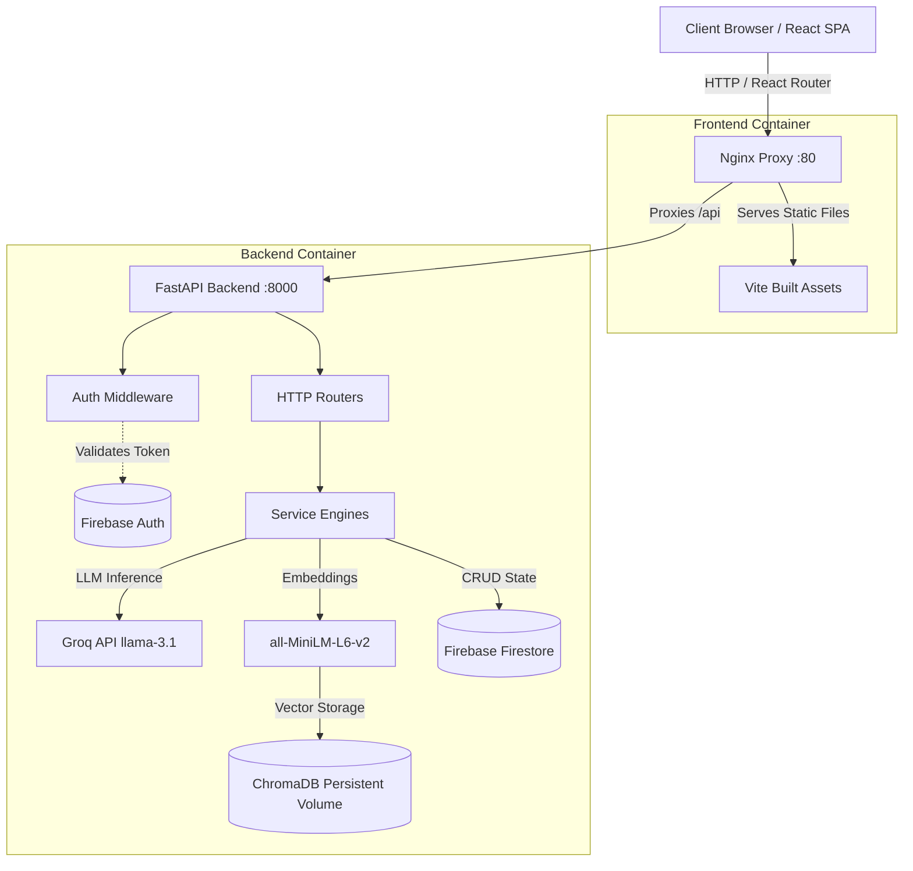
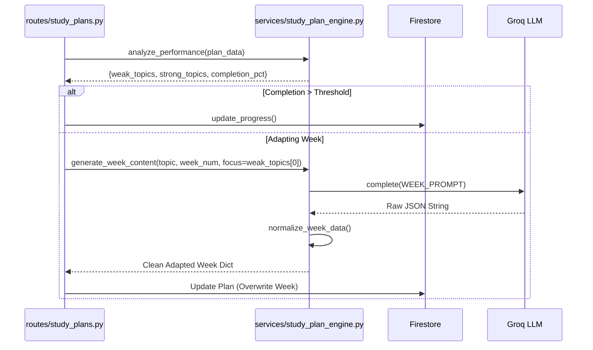

# System Architecture

StudyBuddy is built on a decoupled, async-first architecture optimized for speed, maintainability, and seamless AI integration.

## High-Level System Architecture

The following diagram illustrates the high-level infrastructure and request flow of the containerized environment.

## Retrieval-Augmented Generation (RAG) Pipeline

When a user uploads a document (e.g., a PDF lecture), the backend processes it into semantic chunks for real-time querying.

```mermaid
sequenceDiagram
    actor User
    participant Frontend
    participant API as FastAPI (routes/documents.py)
    participant RAG as RAG Service
    participant Embed as Embedding Model
    participant DB as ChromaDB
    
    User->>Frontend: Upload PDF Document
    Frontend->>API: POST /documents/upload (multipart/form-data)
    API->>RAG: ingest_document(file)
    
    rect rgb(30, 40, 50)
        Note right of RAG: Processing Pipeline
        RAG->>RAG: Extract Text via pypdf
        RAG->>RAG: Chunk Text (400 words, 50 overlap)
    end
    
    RAG->>Embed: embed_texts(chunks)
    Embed-->>RAG: Vector Embeddings
    
    RAG->>DB: Upsert Vectors (Collection = doc_id)
    DB-->>RAG: Success
    
    RAG-->>API: Extraction Metadata
    API-->>Frontend: 200 OK (doc_id)
```

## Adaptive Study Plan Engine

The Study Plan system operates entirely decoupled from HTTP concerns. When a user completes tasks and takes tests, the system analyzes their performance to dynamically adapt future weeks.

## Backend Modular Structure

The backend separates concerns vertically by feature domain and horizontally by abstraction layer:

- **`main.py`**: FastAPI application factory, CORS setup, Lifespan tasks.
- **`routes/`**: Fast, clean HTTP controllers. They parse Pydantic schemas, invoke services, and return standard status codes.
- **`services/`**: The core business intelligence. Connects to LLMs, handles vector mathematics, and orchestrates data aggregation.
- **`models/`**: Pydantic schemas enforcing input validation and output serialization.
- **`middleware/`**: Request interceptors (e.g., `verify_firebase_token` for seamless auth).
